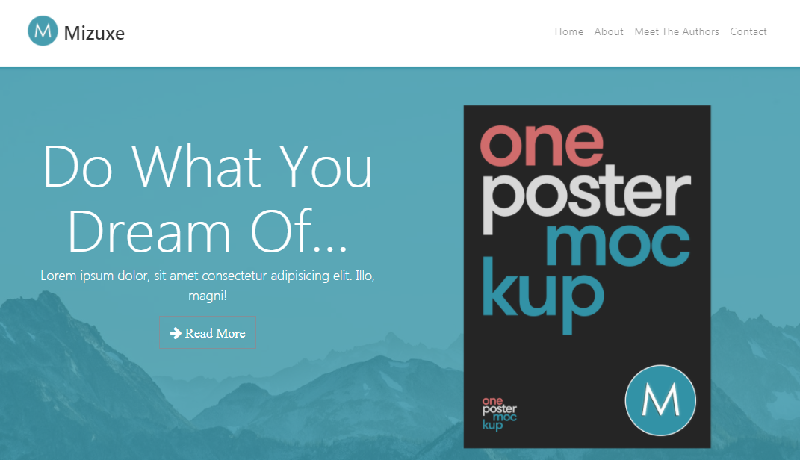

# Mizuxe - Book Showcase Website

This is a project website created using Bootstrap 4-Beta.

## Install Dependencies

```bash
yarn
```

## Compile Sass & Run Dev Server

```bash
yarn start
```

Files are compiled into /src

[View demo site here.](https://webdevtuts.github.io/mizuxe_book_showcase_site/)


